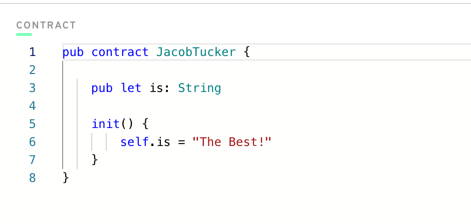
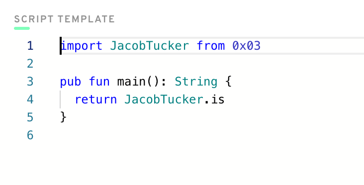

# Chapter 1

## Day 1

1. **A blockchain** is a decentralised ledger that uses public key cryptography. There are different consensus mechanisms to secure a blockchain, the first was proof of work and there are many different flavours of proof of stake. Both systems employ a system of nodes to verify the state of the ledger and add new blocks (records). Most blockchains are permissionless so anyone can use them or participate in running a node. 

Blockchains were a revolutionary invention bringing together cryptogaphy and austrian economics to enable provable ownership and transfer of digital assets, which was previously not solved due to the double spend problem.

2. **A smart contract** is a code written to a blockchain that can automatically execute actions when it's predefined conditions are met.
3. - **A script** reads from a blockchain and does not cost anything.

   - **A transaction**  interacts with a blockchain and requires a transaction fee to execute

## Day 2

1. **The 5 pillars of Cadence:**
   - Safety & security 
   - Clarity 
   - Approachability
   - Developer Experience 
   - Resource Oriented
2.  All of these points are directly addressing weaknesses in Solidity.

# Chapter 2

## Day 1



## Day 2
1. We wouldn't call changeGreeting in a script because it requires change and therefore a transaction.

2. AuthAccount is used to access the data in your account.

3. - Prepare phase is to access the information in your account.
   - Execute phase is to change data on the blockchain.
  
4. Code

**Contract**

```
pub contract HelloWorld {

    pub var greeting: String
    pub var myNumber: Int

    pub fun changeGreeting(newGreeting: String) {
        self.greeting = newGreeting
    }

    pub fun updateMyNumber(newNumber: Int) {
        self.myNumber = newNumber
    }

    init() {
        self.greeting = "Hello, World!"
        self.myNumber = 0
    }
}
```

**Script**

```
import HelloWorld from 0x01

pub fun main(): Int {
    return HelloWorld.myNumber
}
```

**Transaction**

```
import HelloWorld from 0x01

transaction(myNewNumber: Int) {

  prepare(signer: AuthAccount) {}

  execute {
    HelloWorld.updateMyNumber(newNumber: myNewNumber)
  }
}
```
